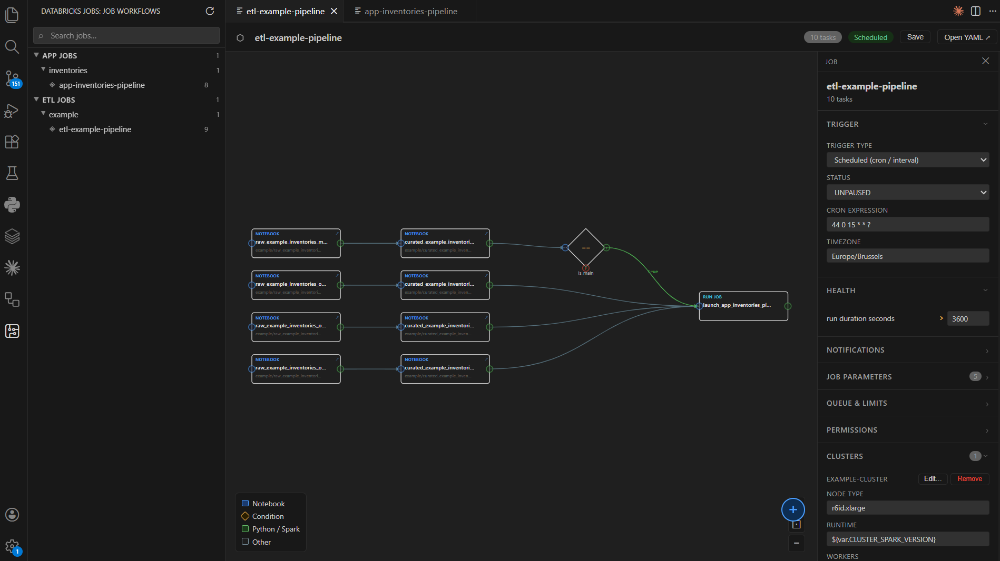

# Databricks Job Viewer — VS Code Extension

> **Test version** — This extension was built to answer my own day-to-day needs working with Databricks LakeFlow YAML job definitions. It is shared as-is. If it fits your workflow too, feel free to fork it and adapt it.

**Author:** Skander Boudawara — [skander.education@proton.me](mailto:skander.education@proton.me)

**Open source** — Fork it, improve it, make it yours.

> Part of the code was written with the assistance of AI.

---

## What does this extension do?

When you work with [Databricks Declarative Automation Bundles](https://docs.databricks.com/aws/en/dev-tools/bundles/), your jobs are defined as YAML files. Reading and editing those files in a text editor quickly becomes painful as the number of tasks grows.

This extension gives you a **visual DAG (Directed Acyclic Graph) panel** directly inside VS Code that lets you see the full structure of a job at a glance — and edit it without touching the YAML by hand.

---

## Screenshots

### Databricks UI (reference)


### Extension UI



---

## Features

### Sidebar — Job Browser

- A searchable **Job Workflows** panel in the VS Code activity bar lists all jobs found under `resources/app_jobs/**/*.yml` and `resources/etl_jobs/**/*.yml`.
- Jobs are **grouped by category and sub-category** (folder structure), with collapsible sections.
- **Fuzzy search bar** at the top of the panel — type any substring or fuzzy pattern (e.g. `"kay"` matches `"kaylani_etl"` or `"k_async_yearly"`). Matched characters are highlighted in the results.
- Each job entry shows the task count and an **Open YAML** (↗) button.
- Collapse state is persisted across reloads.
- **Refresh** button in the panel title reloads all jobs from disk.

---

### DAG Canvas — Job Visualization

- Opens a **full interactive DAG panel** when you click a job.
- Tasks are laid out automatically using a topological sort (left-to-right by dependency level).
- Each task node shows its **type** (Notebook, Spark Python, Python Wheel, SQL, Run Job, Condition), **name**, and **notebook path** (if applicable).
- **Condition tasks** are rendered as diamonds with True/False output ports.
- **Color-coded edges** — grey for unconditional, green for `true`, red for `false` outcomes.
- **Outcome labels** on edges.
- Pan (drag), zoom (scroll wheel or buttons), and **Fit to view** button.

---

### Task Interaction

- **Click a task** to open its detail panel in the bottom bar.
- **Double-click a notebook task** to open the notebook file in the editor.
- **Drag a task** to reposition it on the canvas.

---

### Port-based Dependency Editing

- Each task node has **port circles** (In on the left, Out on the right; Condition tasks have True/False output ports).
- **Drag from an output port to an input port** to create a new dependency edge.
- **Hover an edge** to reveal a × button — click it to delete that dependency.

---

### Task Panel (Bottom Bar)

Clicking a task opens a detail panel at the bottom of the canvas with the following editable sections:

- **Task name** — rename inline (updates all `depends_on` references automatically on save).
- **Run if** — selector for `ALL_SUCCESS`, `AT_LEAST_ONE_SUCCESS`, `NONE_FAILED`, etc.
- **Upstream Dependencies** — interactive list:
  - Click a dependency to navigate to that task.
  - **− button** to remove a dependency.
  - **Add upstream task** dropdown + outcome selector (any / true / false) to add a new dependency.
- **Condition** (read-only display for condition tasks).
- **Compute** — job cluster and environment selectors, max retries, retry interval.
- **Task Parameters** — editable key/value pairs.
- **Libraries** — view current libraries with a **Modify Libraries** button to open the library editor.
- **Remove task** — red button at the bottom that **immediately** removes the task from the YAML (no Save needed). All `depends_on` references to that task in other tasks are cleaned up automatically.

---

### Add New Task

- A **blue + button** (circle, bottom-right of the canvas) opens the **New Task** form in the bottom bar.
- Choose the task type: **Notebook**, **Run Job** (reference another job from the workspace), or **Condition**.
- Fill in the type-specific fields (notebook path / job name / condition operator + values).
- Click **Add to DAG** — the task is **immediately written to the YAML file** and appears on the canvas. No Save button needed.
- The new task can then be connected to others via port dragging.

---

### Job Panel (Right Sidebar)

The right sidebar shows job-level properties when no task is selected:

- **Job name** — editable directly in the topbar.
- **Description** — editable text field.
- **Trigger** — dropdown to change trigger type (Manual, Scheduled/Cron, Table Update, File Arrival) with type-specific fields:
  - **Scheduled**: cron expression + timezone, or interval + unit.
  - **Table Update**: "Trigger when" condition (Any / All tables updated) + table list.
  - **File Arrival**: URL field.
- **Timeout** and **Max concurrent runs**.
- **Queue enabled** toggle.
- **Health rules** — editable threshold values.
- **Job Parameters** — editable default values.
- **Job Clusters** — view, edit, add, and remove job clusters with full configuration (node type, Spark version, worker mode: fixed / autoscale / single node, init scripts, Spark conf, etc.).
- **Environments** — view, edit, add, and remove serverless environments with dependency lists.
- **Permissions** — list of users/groups/service principals with their permission levels.
- **Email Notifications** display.

---

### Editing & Saving

- All edits are tracked as **pending changes** (highlighted Save button).
- A **Revert** button cancels all pending changes and restores the last saved state.
- The **Save** button writes all pending changes to the YAML file. After saving, the panel reloads from the updated file.
- Task additions and removals are saved **immediately** without needing the Save button.

---

## Installation

Download the `.vsix` file from the [Releases](../../releases) page and install it in VS Code:

```
Extensions panel → ··· menu → Install from VSIX…
```

Or via the CLI:

```bash
code --install-extension databricks-job-viewer-<version>.vsix
```

The extension activates automatically when your workspace contains `resources/**/*.yml` or `databricks.yml` files.

---

## Requirements

- VS Code `^1.85.0`
- A Databricks bundle project with job YAML files under `resources/app_jobs/` or `resources/etl_jobs/`

---

## License

MIT — do whatever you want with it.
